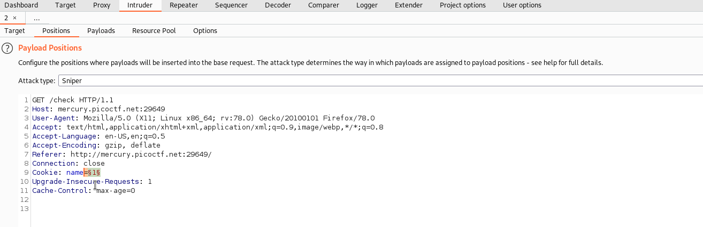
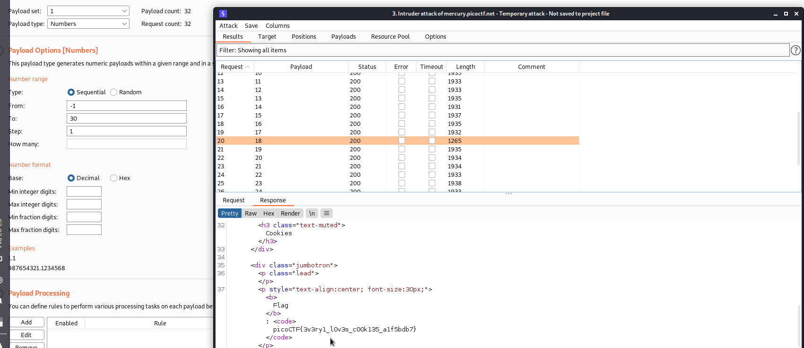

# Cookies
### Points: 40

## Category
#### Web Exploitation

## Question
#### Who doesn't love cookies? Try to figure out the best one. http://mercury.picoctf.net:29649/
### Hint
>#### (None)
### Viwe This web page 

## Solution

### There are two types of solutions.
#### One is a Manual solution, and the other is a Burpsuite Solution for burt force .  
### Manual solution :
##### Download the extension for Chrome or Firefox. cookie-editor is the name of the extension.  

##### I typed in "snickerdoodle" and entered it.
>##### I love chocolate chip cookies!

#### I kept increasing the numeric value of value by 1 until at 18, it gave the flag:

### Burpsuite :
##### Launch the burpsuite and Intercept your request, then send to repeter , next set `cookie: name=$-1$` payload positions .

#### Next go to the payload section and set payload set: `1` , set payload type: `Number` next go to payload optiones then set type: `Sequential`, set from: `-1`, set to: `30` set step: `1` then start attack .
#### After that, have a look at this response. 

## Flag
`picoCTF{3v3ry1_l0v3s_c00k135_a1f5bdb7}`