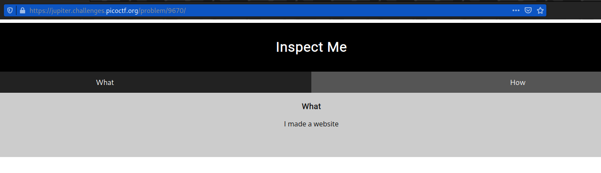
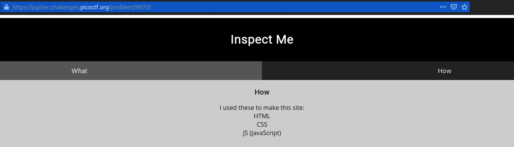
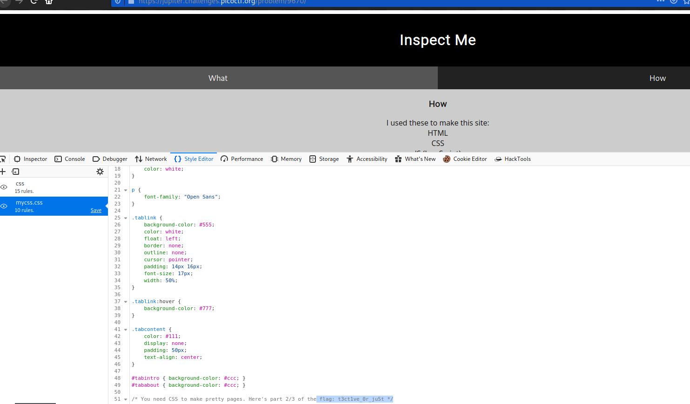

# Insp3ct0r
### Points: 50

## Category
#### Web Exploitation

## Question
#### Kishor Balan tipped us off that the following code may need inspection: https://jupiter.challenges.picoctf.org/problem/9670/ [link](https://jupiter.challenges.picoctf.org/problem/9670/) or http://jupiter.challenges.picoctf.org:9670
### Hint
>#### 1. How do you inspect web code on a browser?
>#### 2. There's 3 parts

## Solution
### Look at this website `What`

#### To obtain the first flag, first write click, then view page source . 

### Look at this website `How`

#### Second flag, Write click then click to `inspect element`  
#### Next, To get the second flag, open the `style editor`, then navigate to the `mycss.css` file and read all of the text. 

#### The third flag, Go to the `network`, refresh the page, and then double-click `myjs.js` to obtain the flag. 

## Flag
`picoCTF{tru3_d3t3ct1ve_0r_ju5t_lucky?2e7b23e3}`