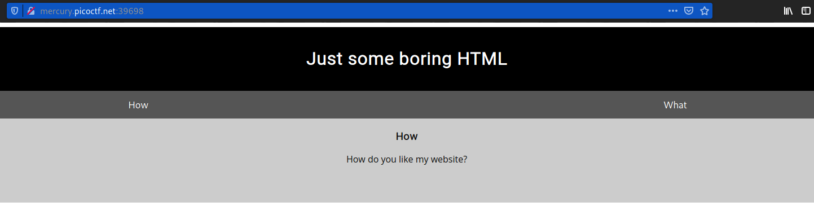
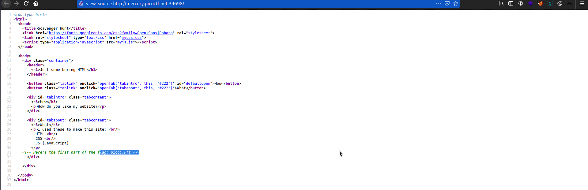
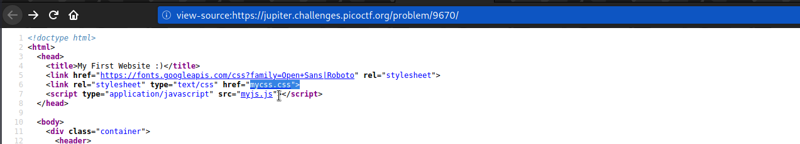
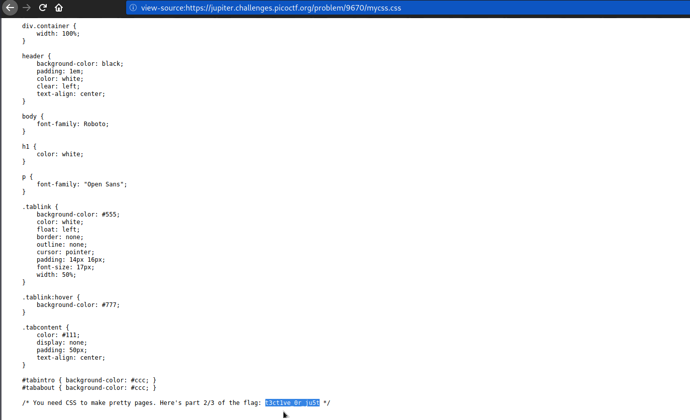
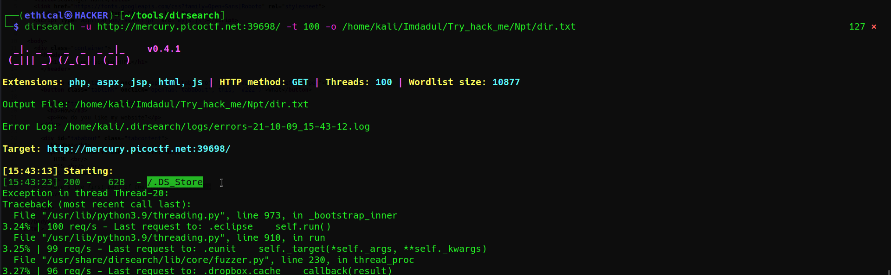
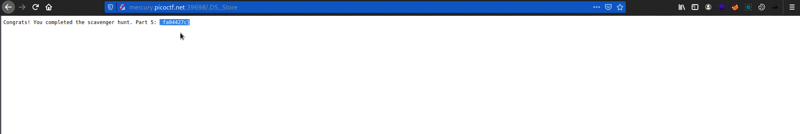

# Scavenger Hunt
### Points: 50

## Category
#### Web Exploitation

## Question
#### There is some interesting information hidden around this site http://mercury.picoctf.net:39698/. Can you find it?
### Hint
>#### You should have enough hints to find the files, don't run a brute forcer.

## Solution
### Look at this website `What`

#### To obtain the first flag, first write click, then view page source . 

### The second flag , click `mycss.css`

#### The third flag, Directory Search 

#### Go to `/.DS_Store` directory get the third flag

## Flag
`picoCTF{tru3_d3h4ts_4_l0_fa04427c}`