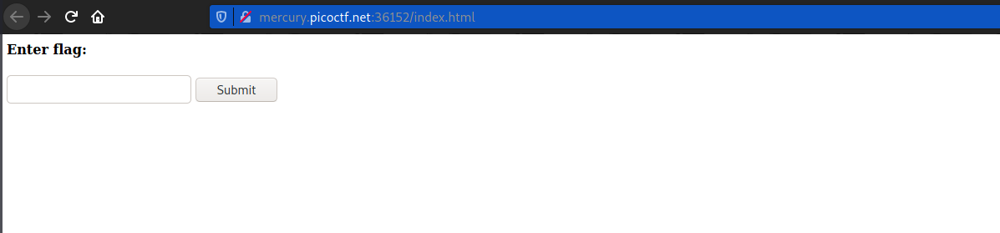
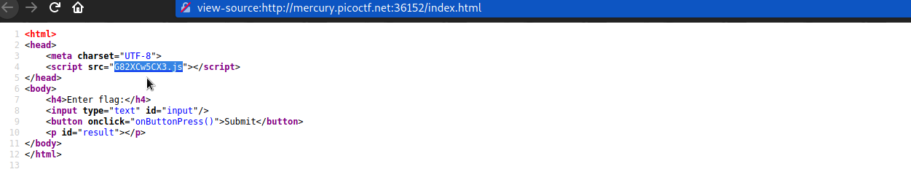
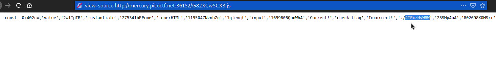
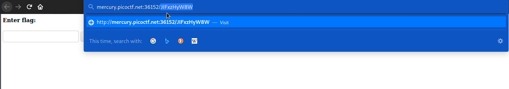
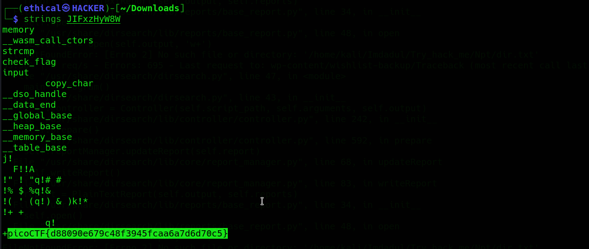

# Some Assembly Required 1
### Points: 70

## Category
#### Web Exploitation

## Question
#### http://mercury.picoctf.net:36152/index.html
### Hint
>#### (None)

## Solution

### Look at this website `What`

#### First write click, then view page source . and Double-click `G82XCw5CX3.js`

#### Read through the entire javascript code. After reading it, I obtained one file path. 

#### Copy the file path and paste the url into the browser, then download the file. 

#### After downloading, launch kali linux terminal and execute this command. `strings (file name)` 

## Flag
`picoCTF{d88090e679c48f3945fcaa6a7d6d70c5}`