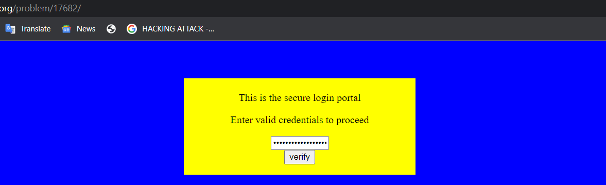

# Dont-use-client-side
### Points: 

## Category
#### Web Exploitation

## Question
#### Can you break into this super secure portal? https://jupiter.challenges.picoctf.org/problem/17682/ [link](https://jupiter.challenges.picoctf.org/problem/17682/) or http://jupiter.challenges.picoctf.org:17682
### Hint
>#### Never trust the client


## Solution
### Look at this website


#### Fast write click and click inspet element, then read the html and javascript code . 

#### After reading, obtain the flag . 
```bash
0   = (0, split)=>pico
1-2 = (split, split*2)=>CTF{
2-3 = (split*2, split*3)=>no_c
3-4 = (split*3, split*4)=>lien
4-5 = (split*4, split*5)=>ts_p
5-6 = (split*5, split*6)=>lz_b
6-7 = (split*6, split*7)=>706c
7-8 = (split*7, split*8)=>5}

```


## Flag
`picoCTF{no_clients_plz_b706c5}`